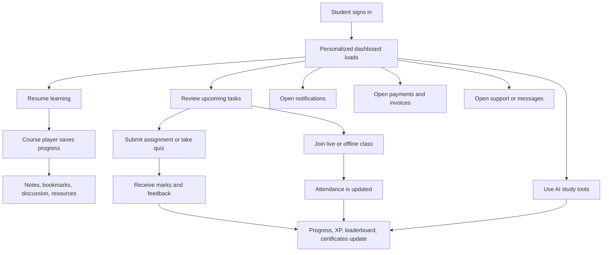

## 1. Product Overview
TechHat Student Dashboard is the authenticated learning hub for enrolled students across online, offline, and hybrid programs. It consolidates learning, communication, assessments, payments, certificates, support, and AI-assisted study tools inside one enterprise-grade interface.

- Primary users: enrolled students, trainers interacting through student-facing surfaces, and support/admin teams controlling visibility and access through feature flags and permissions.
- Business value: improve student retention, completion rate, attendance, upsell readiness, payment transparency, support responsiveness, and measurable learning outcomes for TechHat IT Institute.

## 2. Core Features

### 2.1 User Roles
| Role | Registration Method | Core Permissions |
|------|---------------------|------------------|
| Student | Admission + Supabase Auth | Access enrolled courses, assignments, quizzes, payments, certificates, profile, AI tools |
| Trainer | Admin-created or invited account | Publish lessons, review assignments, manage attendance, comment, message students |
| Support Agent | Admin-created account | Manage support tickets, messages, notices, payment follow-up |
| Admin | Internal back office | Control feature flags, visibility, permissions, content, analytics, notices, and billing |

### 2.2 Feature Modules
1. **Dashboard Home**: personalized overview, progress summary, streak, goals, quick actions, upcoming items, notifications.
2. **Learning Hub**: my courses, continue learning, bookmarks, wishlist, downloads, recorded classes, offline course info.
3. **Course Player**: lesson playback, transcript, resources, notes, bookmarks, discussion, subtitles, progress tracking.
4. **Academic Workflow**: assignments, quizzes, projects, attendance, certificates, notes, calendar.
5. **Gamification and Analytics**: XP, coins, streaks, badges, milestones, rankings, progress graphs.
6. **Communication and Community**: messages, announcements, discussion, community posts, support ticketing, help center.
7. **Billing and Documents**: payment status, installments, invoices, receipts, downloadable records.
8. **Profile and Settings**: personal profile, education, guardian data, language, theme, privacy, password, 2FA.
9. **AI Learning Assistant**: AI tutor, lesson summary, planner, quiz generator, assignment helper, course recommendations.
10. **Platform Control Layer**: feature flags, access policy by batch and delivery mode, notification rules, localization.

### 2.3 Page Details
| Page Name | Module Name | Feature Description |
|-----------|-------------|---------------------|
| Dashboard Home | Welcome hero | Student name, avatar, student ID, current batch, progress, daily streak, learning time, daily goal |
| Dashboard Home | Quick resume | Last active course, lesson name, estimated time, CTA to resume |
| Dashboard Home | Upcoming agenda | Live classes, assignments, quizzes, exams, payment due reminders |
| Dashboard Home | Stats cards | Courses enrolled, completed, certificates, pending tasks, attendance, typing speed, XP, rank |
| Dashboard Home | Notification rail | Recent alerts, unread count, quick filters, open drawer action |
| Continue Learning | Course cards | Thumbnail, instructor, rating, lesson progress, completion ring, bookmark, resume CTA |
| My Courses | Filterable catalog | Grid/list view, sort, search, category, level, status, online/offline/hybrid filters |
| Course Player | Video workspace | Modern player, lesson playlist, transcript, notes, discussion, resources, subtitles, PiP, fullscreen |
| Offline Course | Batch operations | Schedule, trainer, practical lab, exam date, notice board, materials, attendance, submissions |
| Typing Practice | Typing lab | English, Bangla Bijoy, Bangla Unicode, speed, accuracy, history, leaderboard, certification |
| Assignments | Submission flow | Pending/submitted/reviewed status, marks, teacher feedback, upload, due dates |
| Quizzes | Assessment engine | MCQ, timer, instant results, explanations, review mode, leaderboard |
| Projects | Portfolio management | Assigned/completed projects, GitHub URL, live demo URL, teacher review |
| Certificates | Verification center | Certificate history, PDF download, verification QR, public verification URL |
| Attendance | Calendar analytics | Monthly calendar, present/absent/late states, trends, percentages |
| Achievements | Rewards center | XP, coins, levels, milestones, badges, weekly/monthly goal progress |
| Leaderboard | Ranking views | Institute, batch, weekly, monthly, typing, quiz, XP ranking tabs |
| Calendar | Unified schedule | Live class, exam, assignment deadline, reminder, batch events |
| Notes | Study notes | Per-course and per-lesson notes, search, pin, edit, export |
| Bookmarks | Saved items | Saved lessons, resources, timestamps, discussions, courses |
| Wishlist | Saved courses | Future learning list with conversion to enrollment |
| Messages | Communication inbox | Teacher chat, support chat, announcements, threaded messages |
| Community | Forum | Question-answer, like, reply, share, moderation states |
| Downloads | Asset library | PDF, slides, code, project files, resources with download status |
| Payments | Billing center | Course fee, installment plan, due status, payment history, invoices, receipts |
| Notification Center | Notification drawer/page | Assignment, class, payment, lesson, offer, system alerts with read state |
| Profile | Editable profile | Photo, personal info, guardian, address, education, skills, social links, portfolio, resume |
| Settings | Preference center | Language, theme, privacy, password, 2FA, notification preferences |
| Help Center | Support content | FAQs, contact shortcuts, support article search, escalation paths |
| Support Ticket | Ticket workflow | Open ticket, categorize issue, attach files, track SLA, reply history |

## 3. Core Process
The primary student journey begins when a verified student signs in and lands on a personalized dashboard that surfaces progress, deadlines, and the best next action. From there, the student resumes a lesson, submits work, joins live or offline activities, tracks performance, communicates with teachers or support, and manages billing and certificates without leaving the dashboard shell.

Secondary flows support long-term engagement: students build streaks, earn XP, compare rankings, use AI tools for study planning, and receive proactive reminders for academic and payment events. Admin and trainer controls govern which features are visible to each student based on batch, delivery mode, permissions, and institute settings.

## 4. User Interface Design

### 4.1 Design Style
- Visual direction: premium minimal productivity dashboard with restrained glassmorphism, soft shadows, rounded geometry, and generous whitespace.
- Primary palette: deep neutral base with TechHat blue-indigo accent and subtle emerald/amber/red semantic status tones.
- Surface system: layered cards, translucent utility panels, sticky navigation, progressive disclosure in drawers, sheets, and tabs.
- Typography: modern editorial sans for headings paired with highly legible UI sans for body; strong hierarchy for progress data, deadlines, and call-to-action priority.
- Motion: purposeful micro-interactions only, with animated progress rings, soft hover elevation, sidebar transitions, count-up stats, skeleton shimmer, and panel reveal.
- Accessibility: WCAG AA contrast, visible focus states, keyboard-first navigation, descriptive labels, reduced-motion support, semantic landmarks, ARIA for drawers/tabs/dialogs.

### 4.2 Page Design Overview
| Page Name | Module Name | UI Elements |
|-----------|-------------|-------------|
| Global Shell | Sidebar + top navbar | Collapsible sidebar, search, notifications, theme switcher, language switcher, support CTA |
| Dashboard Home | KPI region | Metric cards, progress ring, quick actions, today agenda, recent activity |
| Learning Hub | Cards and filters | Large thumbnail cards, chips, filter popovers, sort dropdown, progress bars |
| Course Player | Split workspace | Sticky video region, lesson rail, utility tabs, note composer, transcript panel |
| Assignments and Quizzes | Task table + detail panel | Status badges, due-date highlighting, timer, submission modal, result summary |
| Attendance and Analytics | Charts and calendar | Heatmap/calendar, line/bar charts, trend cards, legends |
| Messages and Community | Conversation layout | Thread list, message pane, reply composer, reaction controls |
| Payments | Ledger and invoice cards | Due summary, installment progress, table, downloadable receipts |
| Profile and Settings | Structured forms | Sectioned cards, RHF validation, upload controls, switches, 2FA dialogs |

### 4.3 Responsiveness
- Desktop-first layout with 1440px-optimized information density and adaptive behavior for 1280px, 1024px, 768px, 640px, and below.
- Sidebar collapses into icon rail on tablet and drawer navigation on mobile.
- Cards reflow from dense multi-column layouts to single-column mobile stacks while preserving priority order.
- Course player adapts from multi-panel workspace to vertically stacked media, playlist, and utilities on smaller screens.
- Large tap targets, sticky bottom actions on mobile, swipe-friendly drawers, and keyboard navigation parity across breakpoints.

### 4.4 Content and Empty-State Guidance
- No generic placeholders: all empty states must explain why the screen is empty, what action unlocks value, and which next step is recommended.
- Loading must use skeleton states that preserve layout stability.
- Error states should provide retry, help, and contextual fallback navigation.
- Support, academic, and payment messaging should use real institute wording and operational language suitable for TechHat.

## 5. Functional Scope by Release

### 5.1 Release 1
- Dashboard shell, dashboard home, my courses, continue learning, notifications, profile, settings, payments, downloads, assignments, quizzes, attendance, certificates, messages, support ticket.

### 5.2 Release 2
- Course player enhancements, offline batch module, notes, bookmarks, calendar, leaderboard, achievements, projects, discussion, community, wishlist.

### 5.3 Release 3
- AI tutor, AI summary, planner, recommendation engine, quiz generator, assignment helper, advanced analytics, institute-wide ranking rules.

## 6. Non-Functional Requirements
- Production-ready App Router architecture with server-first data fetching and client islands only where interaction demands it.
- Multi-language support for English and Bangla from first release.
- Dark and light themes with full parity.
- SEO-ready public verification routes and metadata for applicable public surfaces.
- Enterprise-grade observability, typed contracts, secure RLS, audit-friendly state changes, and scalable feature-flagged rollout.
