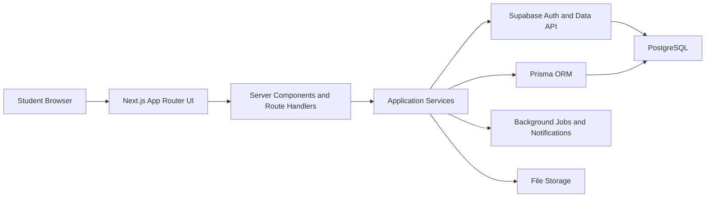
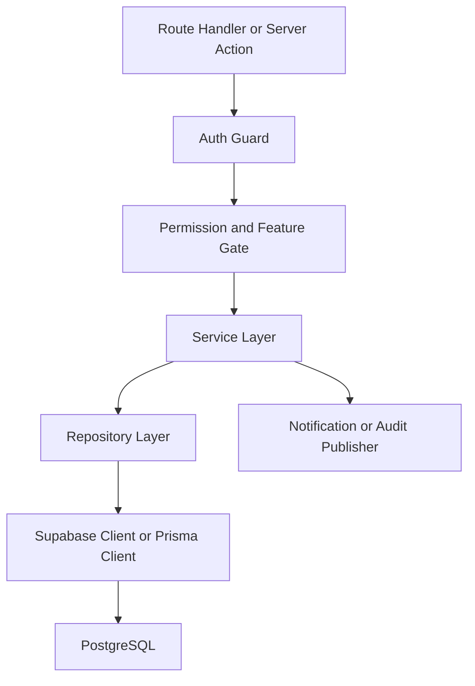
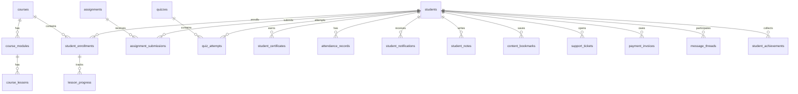

## 1. Architecture Design
The student dashboard will follow a server-first Next.js App Router architecture with authenticated layouts, feature-based route groups, typed server actions and route handlers, Supabase for auth and operational data access, Prisma for typed database workflows, and PostgreSQL as the source of truth. Interactive widgets, charts, forms, drawers, and player controls are isolated into client components while overview pages and initial data loading remain server-rendered.



## 2. Technology Description
- Frontend: Next.js App Router on the current workspace baseline `next@16.2.6`, React 19, TypeScript, Tailwind CSS v4, shadcn/ui, Framer Motion, Lucide Icons.
- Data and auth: Supabase Auth, Supabase Postgres, RLS-enabled tables, server-side session handling via `@supabase/ssr`.
- ORM and contracts: Prisma for typed models, Zod for schema validation, React Hook Form for complex forms.
- Data fetching: server-side queries for initial render, TanStack Query for client-side mutations, optimistic updates, and background refresh.
- Internationalization: `next-intl` with `en` and `bn` locales.
- Design system: feature-driven components composed from atomic UI primitives, theme tokens, motion tokens, and shared shell patterns.
- Media and documents: Next `Image`, secure file delivery, downloadable invoice and certificate assets, transcript and subtitle delivery.

## 3. Route Definitions
| Route | Purpose |
|-------|---------|
| `/dashboard` | Personalized home with progress, tasks, stats, notifications, and quick resume |
| `/dashboard/my-courses` | Filterable course catalog for the authenticated student |
| `/dashboard/continue-learning` | Learning continuation queue based on last activity |
| `/dashboard/courses/[courseId]` | Course overview and lesson map |
| `/dashboard/courses/[courseId]/player/[lessonId]` | Media player with transcript, notes, discussion, resources |
| `/dashboard/assignments` | Assignment list, statuses, submissions, feedback |
| `/dashboard/assignments/[assignmentId]` | Assignment details and submission workspace |
| `/dashboard/quizzes` | Quiz list with availability, attempts, and scores |
| `/dashboard/quizzes/[quizId]` | Quiz session and review screen |
| `/dashboard/certificates` | Certificate history and verification links |
| `/dashboard/downloads` | Downloadable assets by course and type |
| `/dashboard/typing-practice` | Typing lab, modes, history, leaderboard |
| `/dashboard/offline-course` | Offline batch schedule, notices, labs, materials |
| `/dashboard/live-classes` | Upcoming live classes, join links, reminders |
| `/dashboard/recorded-classes` | Recorded session archive |
| `/dashboard/projects` | Assigned and completed projects |
| `/dashboard/attendance` | Attendance calendar, percentage, trends |
| `/dashboard/progress` | Progress analytics and learning charts |
| `/dashboard/achievements` | XP, coins, badges, milestones |
| `/dashboard/leaderboard` | Institute, batch, weekly, monthly ranking |
| `/dashboard/calendar` | Unified calendar for classes, exams, deadlines |
| `/dashboard/notes` | Personal notes and lesson annotations |
| `/dashboard/bookmarks` | Saved lessons, timestamps, and resources |
| `/dashboard/wishlist` | Saved future courses |
| `/dashboard/messages` | Teacher and support messaging |
| `/dashboard/community` | Community feed and discussion forum |
| `/dashboard/discussion` | Course-specific threaded discussion boards |
| `/dashboard/help-center` | Help articles and support shortcuts |
| `/dashboard/support-tickets` | Ticket creation, list, and message thread |
| `/dashboard/payments` | Payment overview, installments, history |
| `/dashboard/invoices` | Invoice list and downloadable invoice details |
| `/dashboard/profile` | Editable student profile |
| `/dashboard/settings` | Language, theme, privacy, password, 2FA, notifications |
| `/certificate/verify/[code]` | Public verification page for certificate authenticity |

## 4. Application Structure
Recommended feature-first structure inside the current repository:

```text
app/
  [locale]/
    (dashboard)/
      dashboard/
        layout.tsx
        page.tsx
        my-courses/page.tsx
        continue-learning/page.tsx
        courses/[courseId]/page.tsx
        courses/[courseId]/player/[lessonId]/page.tsx
        assignments/page.tsx
        quizzes/page.tsx
        certificates/page.tsx
        payments/page.tsx
        profile/page.tsx
        settings/page.tsx
components/
  dashboard/
    shell/
    home/
    courses/
    player/
    assignments/
    analytics/
    communication/
    billing/
    forms/
lib/
  dashboard/
    queries/
    mutations/
    transformers/
    validations/
    permissions/
    feature-flags/
messages/
  en.json
  bn.json
prisma/
  schema.prisma
```

## 5. API Definitions

### 5.1 Key TypeScript Shapes
```ts
export type DashboardHomeResponse = {
  student: {
    id: string
    fullName: string
    avatarUrl: string | null
    studentCode: string
    batchName: string | null
    locale: "en" | "bn"
    themePreference: "light" | "dark" | "system"
  }
  overview: {
    overallCompletionPercent: number
    dailyStreak: number
    learningMinutesToday: number
    weeklyGoalPercent: number
    xpPoints: number
    coins: number
    currentRank: number | null
  }
  stats: {
    coursesEnrolled: number
    completedCourses: number
    certificatesEarned: number
    assignmentsPending: number
    quizzesPending: number
    attendancePercent: number
    typingWpm: number | null
    learningHours: number
  }
  continueLearning: ContinueLearningCard[]
  upcoming: UpcomingItem[]
  notifications: NotificationItem[]
}

export type ContinueLearningCard = {
  enrollmentId: string
  courseId: string
  lessonId: string | null
  title: string
  instructor: string
  thumbnailUrl: string | null
  rating: number | null
  completionPercent: number
  estimatedMinutesLeft: number | null
  lastViewedLesson: string | null
  bookmarked: boolean
}
```

### 5.2 Route Handlers and Server Actions
| Endpoint | Method | Purpose |
|----------|--------|---------|
| `/api/dashboard/home` | `GET` | Load home payload for authenticated student |
| `/api/dashboard/notifications` | `GET` | Paginated notification feed |
| `/api/dashboard/notifications/read` | `POST` | Mark one or many notifications as read |
| `/api/dashboard/course-progress` | `POST` | Save lesson progress heartbeat and completion |
| `/api/dashboard/notes` | `GET/POST/PATCH/DELETE` | Manage course and lesson notes |
| `/api/dashboard/bookmarks` | `GET/POST/DELETE` | Manage content bookmarks |
| `/api/dashboard/assignments/[id]/submit` | `POST` | Upload assignment submission metadata |
| `/api/dashboard/quizzes/[id]/attempt` | `POST` | Start quiz session |
| `/api/dashboard/quizzes/[id]/complete` | `POST` | Submit answers and score attempt |
| `/api/dashboard/payments/history` | `GET` | Load student billing ledger |
| `/api/dashboard/support-tickets` | `GET/POST` | Create and list support tickets |
| `/api/dashboard/messages` | `GET/POST` | List threads and send messages |
| `/api/dashboard/profile` | `PATCH` | Update student profile |
| `/api/dashboard/settings/preferences` | `PATCH` | Update language, theme, notification settings |

### 5.3 Validation Rules
- All mutations validated with Zod on the server boundary.
- File uploads must validate MIME type, size, ownership, and target entity.
- Quiz attempts require attempt window validation, availability validation, and anti-repeat controls.
- Course progress writes must be idempotent and ordered by lesson timestamp.

## 6. Server Architecture Diagram


## 7. Data Model

### 7.1 Domain Strategy
Use the existing TechHat schema where possible and extend it with dashboard-specific entities rather than duplicating course, student, and admission records. The current repository already contains `students`, `admissions`, `courses`, `course_modules`, `course_lessons`, and related course tables in operational code. New dashboard modules should join into this backbone through `student_id`, `course_id`, `lesson_id`, `batch_id`, and `enrollment_id` style keys.

### 7.2 ER Diagram


### 7.3 PostgreSQL Tables to Add or Normalize
| Table | Purpose |
|-------|---------|
| `student_enrollments` | Normalized enrollment state by student and course |
| `lesson_progress` | Granular progress, completion, last viewed timestamp |
| `lesson_resources` | Downloadable files and links per lesson |
| `student_notes` | Per-lesson and per-course notes |
| `content_bookmarks` | Lesson, timestamp, resource, and course bookmarks |
| `assignments` | Assignment definitions |
| `assignment_submissions` | Student submissions, grading, feedback |
| `quizzes` | Quiz definitions and timing |
| `quiz_questions` | Question bank |
| `quiz_attempts` | Attempt session and result |
| `student_certificates` | Certificate issuance and verification |
| `attendance_records` | Daily attendance status |
| `student_notifications` | Read/unread notifications |
| `support_tickets` | Support workflow |
| `support_ticket_messages` | Ticket conversation messages |
| `message_threads` | Direct message threads |
| `message_entries` | Individual messages |
| `student_downloads` | Download audit trail |
| `payment_invoices` | Invoices and billing periods |
| `payment_transactions` | Payment history and receipt data |
| `student_achievements` | Badges, milestones, XP awards |
| `leaderboard_snapshots` | Ranking materialization for weekly/monthly views |
| `typing_sessions` | Typing practice performance history |
| `ai_study_sessions` | AI interactions, summaries, planner outputs |
| `feature_flags` | Institute, batch, or student-scoped feature access |

### 7.4 Prisma Model Direction
Prisma should mirror the normalized student dashboard domain and coexist with Supabase access:
- keep existing simple models,
- add models for new dashboard tables,
- use enum types for attendance status, notification type, quiz state, assignment review state, payment status, delivery mode, and feature-flag scope,
- define compound indexes such as `(student_id, course_id)`, `(student_id, read_at)`, `(quiz_id, student_id, started_at)`, and `(certificate_code)`.

### 7.5 DDL Outline
```sql
create table public.student_enrollments (
  id uuid primary key default gen_random_uuid(),
  student_id uuid not null references public.students(id) on delete cascade,
  course_id uuid not null references public.courses(id) on delete cascade,
  batch_id uuid null,
  delivery_mode text not null check (delivery_mode in ('online','offline','hybrid')),
  status text not null default 'active' check (status in ('active','paused','completed','dropped')),
  enrolled_at timestamptz not null default now(),
  completed_at timestamptz null,
  unique (student_id, course_id)
);

create table public.lesson_progress (
  id uuid primary key default gen_random_uuid(),
  enrollment_id uuid not null references public.student_enrollments(id) on delete cascade,
  lesson_id uuid not null references public.course_lessons(id) on delete cascade,
  watch_seconds integer not null default 0,
  completion_percent numeric(5,2) not null default 0,
  is_completed boolean not null default false,
  last_position_seconds integer not null default 0,
  last_viewed_at timestamptz not null default now(),
  unique (enrollment_id, lesson_id)
);

create table public.student_notifications (
  id uuid primary key default gen_random_uuid(),
  student_id uuid not null references public.students(id) on delete cascade,
  type text not null,
  title text not null,
  body text not null,
  action_url text null,
  created_at timestamptz not null default now(),
  read_at timestamptz null
);

create index idx_student_notifications_unread
  on public.student_notifications (student_id, read_at, created_at desc);
```

## 8. RLS Strategy
- Enable RLS on every exposed table in `public`.
- Student-owned records must use `to authenticated` plus a row ownership predicate based on the linked `student_id`.
- Do not use editable `user_metadata` for authorization decisions. Map auth users to internal student rows using immutable identity linkage stored in secure app metadata or profile mapping tables.
- Trainer and admin access should be granted through role-aware policies plus scoped ownership or institute association predicates.
- Read and write policies must be separated where necessary, and update policies must include both `using` and `with check`.
- Public certificate verification should use either a dedicated `security_invoker` view or an unprivileged public route handler that returns only safe certificate fields.

## 9. Feature Flags and Permissions
- Flags may be scoped at institute, batch, course, student, or role level.
- Core examples: `enable_ai_tutor`, `enable_offline_module`, `enable_typing_lab`, `enable_leaderboard`, `enable_payments`, `enable_messages`.
- Route guards must combine authentication, authorization, and flag checks before loading expensive data.

## 10. SEO, Accessibility, and Performance
- Dashboard routes are authenticated and not search-indexed; public verification routes must include full metadata, canonical URLs, and structured data.
- Use streaming and partial hydration where appropriate, but keep the initial dashboard shell stable with layout-preserving skeletons.
- Prefer server components for initial page payloads and lazy-load heavy charts, video, and discussion widgets.
- Use semantic regions, accessible tables, focus management in drawers/dialogs, and `prefers-reduced-motion` support.

## 11. Implementation Notes for This Repository
- The user requested Next.js 15, but the current workspace is already on `next@16.2.6`. Recommended path: implement the dashboard on the existing Next 16 baseline for stability unless a separate downgrade/migration is explicitly approved.
- The existing dashboard routes at `app/dashboard/*` should be upgraded into a structured shell rather than discarded blindly.
- The repository already uses Supabase server clients and should continue to prefer server-side auth/session checks in the App Router.
- `next-intl` and TanStack Query are not currently wired in this repo and should be introduced during the implementation phase as part of the dashboard foundation work.
